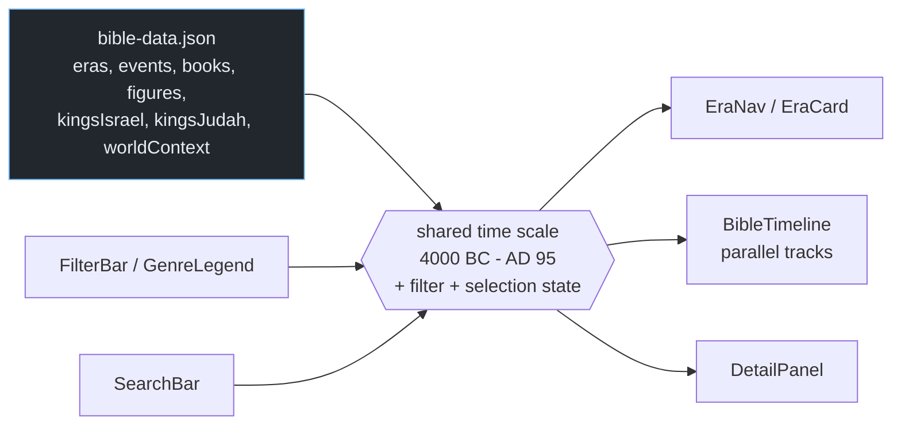

# Bible Timeline

An interactive timeline of biblical history from the Primeval period to the early
church, drawn as parallel tracks on one shared axis: 91 events across 9 eras, all
66 books placed at the era they were written in, 23 figures as lifespan bars, the
19 kings of Israel against the 20 kings of Judah as two separate regnal lines, and
20 "what ordinary life was like" context bands running underneath the whole thing.
Filter by genre or testament, search any book or figure, and click through to
detail. React + D3, one JSON file, no backend.

Built because a list of dates is not a timeline. The thing worth seeing is
*simultaneity* — that the divided monarchy is two overlapping king lists, that a
book sits inside a period rather than after it, and that all of it happened to
people whose daily life is a fact you can put on the same axis.


*Placeholder still. Era navigation, filtering and detail panels are all interactive — a demo GIF replaces this.*

**Live → [bible-timeline-pink.vercel.app](https://bible-timeline-pink.vercel.app)**

---

## What it contains

| Track | Count | Notes |
|---|---|---|
| **Eras** | 9 | Primeval History through The Early Church, spanning 4000 BC – AD 95 |
| **Events** | 91 | Typed `major` (41), `event` (44) or `birth` (6) |
| **Books** | 66 | Testament, genre, author, date written, era, theme, key verse |
| **Figures** | 23 | Drawn as lifespan bars, grouped (patriarchs, prophets, kings…) |
| **Kings of Israel** | 19 | Northern kingdom regnal line |
| **Kings of Judah** | 20 | Southern kingdom regnal line, drawn parallel |
| **World context** | 20 | Bands describing ordinary life, by region and category |

Genre breakdown across the 66: Epistle 21 · Prophecy 17 · History 13 · Law 5 ·
Gospel 4 · Wisdom 3 · Poetry 3.

**The details that would have made it wrong:**

- **Israel and Judah are two tracks, not one.** After the split in 931 BC the
  kingdoms have separate, overlapping regnal lines. Merging them into a single
  "kings" row would erase the fact the divided monarchy *is*.
- **Years are stored as signed integers**, negative for BC, so the axis is
  continuous arithmetic rather than two eras glued together. There is no year
  zero in the calendar, but there is on this axis, and it is 1 BC/AD 1 — a
  deliberate simplification that keeps the scale linear.
- **A book's position is when it was *written*, not when its events happened.**
  Job sits by composition date, not by patriarchal setting. These are different
  questions and the timeline answers the first one.
- **World-context bands are the point, not decoration.** "Literacy was almost
  unknown, life expectancy hovered near 30–40 years" is the frame that makes the
  events legible, and it belongs on the axis rather than in a footnote.

---

## Architecture



The important edge: **filtering and search write to the same state the tracks
read from.** Selecting the Prophecy genre does not tell seven track components to
hide things — it changes one value, and every track re-derives what it draws. That
is why a track can be added without touching the filter code.

---

## Quickstart

```bash
npm install
npm run dev
```

One data file, no keys, no network at runtime.

---

## Using it

- **Everything shares one axis**, so vertical alignment is meaningful: a book, a
  king and a world-context band at the same horizontal position are contemporary.
- **Filter by genre and the whole timeline thins**, rather than a single list
  filtering. That is what makes "when were the epistles written" a shape rather
  than a query.
- **The two king tracks are drawn adjacent on purpose.** Read down and you can see
  which king of Judah reigned against which king of Israel, which is tedious to
  reconstruct from a table.
- **Figures are bars, not points**, because a lifespan overlapping three eras is
  the interesting fact about a patriarch.
- **Era navigation jumps the scale** rather than scrolling it, since 4,000 years
  at readable resolution is longer than any useful scroll.

---

## Data shape

```jsonc
{
  "eras":    [ { "name": "United Monarchy", "start": -1060, "end": -932 } ],
  "events":  [ { "label": "...", "year": -931, "eraId": "...",
                 "type": "major" } ],            // major | event | birth
  "books":   [ { "name": "Amos", "testament": "OT", "genre": "Prophecy",
                 "author": "...", "dateWritten": "...", "eraId": "...",
                 "theme": "...", "keyVerse": "..." } ],
  "figures": [ { "name": "Abraham", "start": -2166, "end": -1991,
                 "group": "patriarchs" } ],
  "kingsIsrael": [ { "name": "Jeroboam I", "start": -931, "end": -908 } ],
  "kingsJudah":  [ /* 20 */ ],
  "worldContext": [ { "name": "Nomadic Herding World", "start": -4000,
                      "end": -1900, "category": "life", "region": "Near East",
                      "description": "..." } ]
}
```

Negative years are BC. Every track is a flat array with `start`/`end` or `year`,
which is what lets one scale drive all of them.

---

## Project layout

```
src/
  data/bible-data.json     the entire dataset — seven parallel arrays
  components/
    BibleTimeline          the axis and all parallel tracks
    EraNav / EraCard       era jumping and era summaries
    FilterBar              genre and testament filters
    GenreLegend            the genre colour key
    DetailPanel            selected book, figure, king or event
    SearchBar              books and figures
    ThemeToggle
```

---

## Methodology and limits

**The chronology is a traditional one, and that is a choice.** The Primeval
History era starts at 4000 BC and Abraham's life is dated 2166–1991 BC. These come
from a conservative reconstruction built on internal biblical genealogies. They are
not archaeological findings, and they are not the consensus of academic ancient
Near Eastern chronology, which places the patriarchal material later, treats the
primeval material as a different genre entirely, or declines to date it at all.
The timeline commits to one tradition because a timeline has to commit to
something — but a reader should know which one, and that other reconstructions
would move the left half of this chart substantially.

**Dates get firmer as you move right.** The divided monarchy onward can be
cross-checked against Assyrian and Babylonian records and is reasonably secure to
within a few years. Everything before the united monarchy is progressively less
so. The chart draws all eras with the same visual confidence, which flatters the
early ones; treat the leftmost bands as schematic.

**Book authorship follows traditional attribution.** Where authorship is
academically contested — Daniel, the Pastoral Epistles, 2 Peter, several prophets
— the `author` field records the traditional attribution without flagging the
dispute. The sister project *Paul's World* models contested attribution explicitly;
this one does not yet, and that is a gap rather than a position.

**There is a year zero on this axis and not in history.** Harmless at this scale,
wrong by one year if you difference a BC date against an AD one.

**What this is not.** Not a study Bible, not a commentary, and not an argument for
any dating scheme over another.

---

## Data sources

| Source | Used for |
|---|---|
| Biblical text — genealogies, regnal formulae, internal chronology | Era boundaries, king lists, figure lifespans |
| Traditional reference chronologies | Era dating and book composition dates |
| General ancient Near East and Roman social history | The 20 world-context bands |

All compiled by hand into a single committed JSON file. No API keys, no accounts,
no runtime dependencies beyond React and D3.
